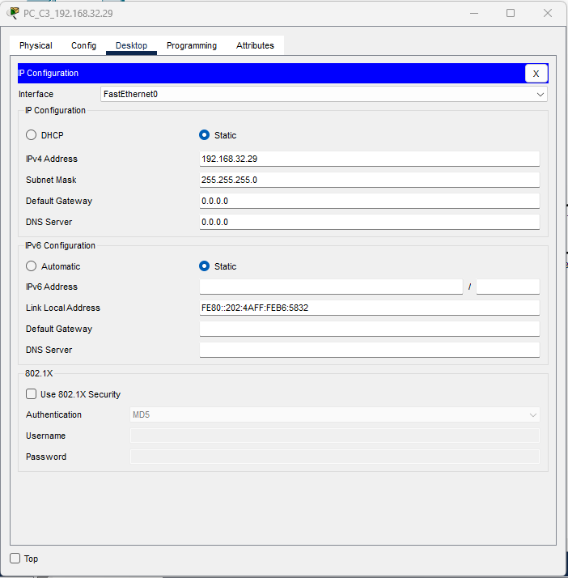
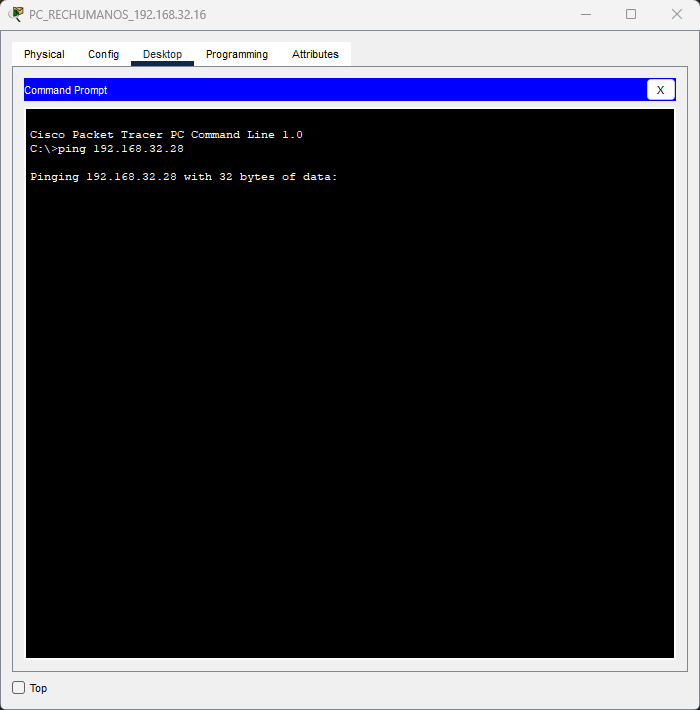

**Nombre**: Douglas Alexander Soch Catalán

**Carnet**: 201807032

# Manual Tecnico

### Requerimientos

Cisco Packet Tracer - 8.2

### Topologia

Existen dos niveles, cada uno equipado con un SWITCH que estan interconectados, ya que cada SWITCH se encarga de controlar un nivel específico.

El primer nivel cuenta con las siguientes areas:

* Administración
* Gerencia
* Atención al cliente
* Recursos humanos

El segundo nivel cuenta con las siguientes areas:

* Oficinas A
* Oficinas B
* Oficinas C

### Configuración de VPCs

#### 1. Administrativa

#### 2. Gerencia

#### 3. Atención al cliente

#### 4. Recursos humanos

#### 5. Oficinas A

#### 6. Oficinas B

#### 7. Oficinas C

### Pings entre Hosts

#### Ping del Host 192.168.32.12 al Host 192.168.32.28

#### Ping del Host 192.168.32.15 al Host 192.168.32.22

#### Ping del Host 192.168.32.211 al Host 192.168.32.13

### ARP/ICMP

#### Selección de los protocolos

#### Ping del Host 192.168.32.16 al Host 192.168.32.28

#### Buscando el Host

#### Host encontrado

#### Respuesta del Host 192.168.32.28 al Host 192.168.32.16

#### Envio del paquete del Host 192.168.32.16 al Host 192.168.32.28

#### Lista de Eventos

