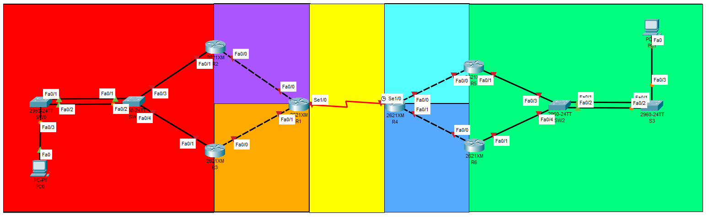

# Practica 2

_Este es una practica universitaria del curso de Redes de Computadoras 1._

## 🚀 Comenzando

### 📋 Requerimientos

* Cisco Packet Tracer - 8.2.1.0118

### Indice

* [Documentación](#documentacion)
    * [Topologia](#topologia)
    * [Asignación de IPs y Mascaras](#asignacion-ips-mascaras)
    * [Configuración de Routers](#configuracion-routers)
        * [R1](#r1)
        * [R4](#r4)
        * [R2](#r2)
        * [R3](#r3)
        * [R5](#r5)
        * [R6](#r6)
    * [Configuración de Switches](#configuracion-switches)
        * [SW0](#sw0)
        * [SW1](#sw1)
        * [SW2](#sw2)
        * [SW3](#sw3)
    * [Configuración de VPCs](#configuracion-vpcs)
        * [VPC0](#vpc0)
        * [VPC1](#vpc1)
    * [Ping Entre Hosts](#ping-hosts)

### 🎁 Otros

* [Enunciado]([REDES1]Practica2.pdf)

## 📖 Documentacion <div id='documentacion'></div>

### 🔎 Topologia <div id="topologia"></div>



### 🔢 Asignación de IPs y Mascaras <div id="asignacion-ips-mascaras"></div>

| Dispositivo       | Interfaz | Dirección IP | Mascara de subred |
|-------------------|----------|--------------|-------------------|
| R1                | s0/0     | 10.0.0.1     | 255.255.255.252   |
| R1                | f0/0     | 122.168.1.2  | 255.255.255.248   |
| R1                | f0/1     | 122.168.2.2  | 255.255.255.248   |
| R2                | f0/0     | 122.168.1.1  | 255.255.255.248   |
| R2                | f0/1     | 122.168.0.2  | 255.255.255.0     |
| R3                | f0/0     | 122.168.2.1  | 255.255.255.248   |
| R3                | f0/1     | 122.168.0.3  | 255.255.255.0     |
| R2 - R3 (Virtual) |          | 122.168.0.1  | 255.255.255.0     |
| VPC11             | eth0     | 122.168.0.4  | 255.255.255.0     |
| R4                | s0/0     | 10.0.0.2     | 255.255.255.252   |
| R4                | f0/0     | 122.178.1.1  | 255.255.255.248   |
| R4                | f0/1     | 122.178.2.1  | 255.255.255.248   |
| R5                | f0/0     | 122.178.1.2  | 255.255.255.248   |
| R5                | f0/1     | 122.178.0.2  | 255.255.255.0     |
| R6                | f0/0     | 122.178.2.2  | 255.255.255.248   |
| R6                | f0/1     | 122.178.0.3  | 255.255.255.0     |
| R5 - R6 (Virtual) |          | 122.178.0.1  | 255.255.255.0     |
| VPC12             | eth0     | 122.178.0.4  | 255.255.255.0     |

### 🔩 Configuración de Routers <div id="configuracion-routers"></div>

#### Para el R1 <div id="r1"></div>

* Configuración inicial

    ```python
    enable
    conf t
    no ip domain-lookup
    hostname R1
    do w
    ```

* Configuración de la IP y mascara en cada puerto correspondiente

    ```python
    interface s0/0
    ip address 10.0.0.1 255.255.255.252
    no shutdown
    interface f0/0
    ip address 122.168.1.2 255.255.255.248
    no shutdown
    interface f0/1
    ip address 122.168.2.2 255.255.255.248
    no shutdown
    do w
    exit
    ```

* Configuración de las rutas estaticas

    ```python
    ip route 10.0.0.0 255.255.255.252 10.0.0.2 # Para el amarillo
    ip route 122.168.1.0 255.255.255.248 122.168.1.1 # Para el purpura
    ip route 122.168.2.0 255.255.255.248 122.168.2.1 # Para el anaranjado
    ip route 122.168.0.0 255.255.255.0 122.168.1.1 # Para el rojo
    ip route 122.168.0.0 255.255.255.0 122.168.2.1 # Para el rojo
    ip route 122.178.1.0 255.255.255.248 10.0.0.2 # Para el celeste
    ip route 122.178.2.0 255.255.255.248 10.0.0.2 # Para el azul
    ip route 122.178.0.0 255.255.255.0 10.0.0.2 # Para el verde
    do w
    ```

#### Para el R4 <div id="r4"></div>

* Configuración inicial

    ```python
    enable
    conf t
    no ip domain-lookup
    hostname R4
    do w
    ```

* Configuración de la IP y mascara en cada puerto correspondiente

    ```python
    interface s0/0
    ip address 10.0.0.2 255.255.255.252
    no shutdown
    interface f0/0
    ip address 122.178.1.1 255.255.255.248
    no shutdown
    interface f0/1
    ip address 122.178.2.1 255.255.255.248
    no shutdown
    do w
    exit
    ```

* Configuración de las rutas estaticas

    ```python
    ip route 10.0.0.0 255.255.255.252 10.0.0.1 # Para el amarillo
    ip route 122.178.1.0 255.255.255.248 122.178.1.2 # Para el celeste
    ip route 122.178.2.0 255.255.255.248 122.178.2.2 # Para el azul
    ip route 122.178.0.0 255.255.255.0 122.178.1.2 # Para el verde
    ip route 122.178.0.0 255.255.255.0 122.178.2.2 # Para el verde
    ip route 122.168.1.0 255.255.255.248 10.0.0.1 # Para el morado
    ip route 122.168.2.0 255.255.255.248 10.0.0.1 # Para el anaranjado
    ip route 122.168.0.0 255.255.255.0 10.0.0.1 # Para el rojo
    do w
    ```

#### Para el R2 <div id="r2"></div>

* Configuración inicial

    ```python
    enable
    conf t
    no ip domain-lookup
    hostname R2
    do w
    ```

* Configuración de la IP y mascara en cada puerto correspondiente

    ```python
    interface f0/0
    ip address 122.168.1.1 255.255.255.248
    no shutdown
    interface f0/1
    ip address 122.168.0.2 255.255.255.0
    no shutdown
    do w
    ```

* Configuración del protocolo HSRP

    ```python
    standby 10 ip 122.168.0.1
    standby 10 priority 150
    standby 10 preempt
    do w
    exit
    ```

* Configuración de las rutas estaticas

    ```python
    ip route 122.168.1.0 255.255.255.248 122.168.1.2 # Para el morado
    ip route 10.0.0.0 255.255.255.252 122.168.1.2 # Para el amarillo
    ip route 122.178.1.0 255.255.255.248 122.168.1.2 # Para el celeste
    ip route 122.178.2.0 255.255.255.248 122.168.1.2 # Para el azul
    ip route 122.178.0.0 255.255.255.0 122.168.1.2 # Para el verde
    do w
    ```

#### Para el R3 <div id="r3"></div>

* Configuración inicial

    ```python
    enable
    conf t
    no ip domain-lookup
    hostname R3
    do w
    ```

* Configuración de la IP y mascara en cada puerto correspondiente

    ```python
    interface f0/0
    ip address 122.168.2.1 255.255.255.248
    no shutdown
    interface f0/1
    ip address 122.168.0.3 255.255.255.0
    no shutdown
    do w
    ```

* Configuración del protocolo HSRP

    ```python
    standby 10 ip 122.168.0.1
    do w
    exit
    ```

* Configuración de las rutas estaticas

    ```python
    ip route 122.168.2.0 255.255.255.248 122.168.2.2 # Para el anaranjado
    ip route 10.0.0.0 255.255.255.252 122.168.2.2 # Para el amarillo
    ip route 122.178.1.0 255.255.255.248 122.168.2.2 # Para el celeste
    ip route 122.178.2.0 255.255.255.248 122.168.2.2 # Para el azul
    ip route 122.178.0.0 255.255.255.0 122.168.2.2 # Para el verde
    do w
    ```

#### Para el R5 <div id="r5"></div>

* Configuración inicial

    ```python
    enable
    conf t
    no ip domain-lookup
    hostname R5
    do w
    ```

* Configuración de la IP y mascara en cada puerto correspondiente

    ```python
    interface f0/0
    ip address 122.178.1.2 255.255.255.248
    no shutdown
    interface f0/1
    ip address 122.178.0.2 255.255.255.0
    no shutdown
    do w
    ```

* Configuración del protocolo HSRP

    ```python
    standby 20 ip 122.178.0.1
    standby 20 priority 110
    standby 20 preempt
    do w
    exit
    ```

* Configuración de las rutas estaticas

    ```python
    ip route 122.178.1.0 255.255.255.248 122.178.1.1 # Para el celeste
    ip route 10.0.0.0 255.255.255.252 122.178.1.1 # Para el amarillo
    ip route 122.168.1.0 255.255.255.248 122.178.1.1 # Para el morado
    ip route 122.168.2.0 255.255.255.248 122.178.1.1 # Para el anaranjado
    ip route 122.168.0.0 255.255.255.0 122.178.1.1 # Para el rojo
    do w
    ```

#### Para el R6 <div id="r6"></div>

* Configuración inicial

    ```python
    enable
    conf t
    no ip domain-lookup
    hostname R6
    do w
    ```

* Configuración de la IP y mascara en cada puerto correspondiente

    ```python
    interface f0/0
    ip address 122.178.2.2 255.255.255.248
    no shutdown
    interface f0/1
    ip address 122.178.0.3 255.255.255.0
    no shutdown
    do w
    ```

* Configuración del protocolo HSRP

    ```python
    standby 20 ip 122.178.0.1
    do w
    exit
    ```

* Configuración de las rutas estaticas

    ```python
    ip route 122.178.2.0 255.255.255.248 122.178.2.1 # Para el azul
    ip route 10.0.0.0 255.255.255.252 122.178.2.1 # Para el amarillo
    ip route 122.168.1.0 255.255.255.248 122.178.2.1 # Para el morado
    ip route 122.168.2.0 255.255.255.248 122.178.2.1 # Para el anaranjado
    ip route 122.168.0.0 255.255.255.0 122.178.2.1 # Para el rojo
    do w
    ```

### 🔩 Configuración de Switches <div id="configuracion-switches"></div>

#### Para el SW0 <div id="sw0"></div>

* Configuración inicial

    ```python
    enable
    conf t
    no ip domain-lookup
    hostname SW0
    do w
    ```

* Configuración del protocolo PAGP

    ```python
    interface range f0/1-2
    channel-group 1 mode desirable
    do w
    ```

#### Para el SW1 <div id="sw1"></div>

* Configuración inicial

    ```python
    enable
    conf t
    no ip domain-lookup
    hostname SW1
    do w
    ```

* Configuración del protocolo PAGP

    ```python
    interface range f0/1-2
    channel-group 1 mode desirable
    do w
    ```

#### Para el SW2 <div id="sw2"></div>

* Configuración inicial

    ```python
    enable
    conf t
    no ip domain-lookup
    hostname SW2
    do w
    ```

* Configuración del protocolo LACP

    ```python
    interface range f0/1-2
    channel-group 2 mode active
    do w
    ```

#### Para el SW3 <div id="sw3"></div>

* Configuración inicial

    ```python
    enable
    conf t
    no ip domain-lookup
    hostname SW3
    do w
    ```

* Configuración del protocolo LACP

    ```python
    interface range f0/1-2
    channel-group 2 mode active
    do w
    ```

### 🔩 Configuración de VPCs <div id="configuracion-vpcs"></div>

#### Para el VPC0


#### Para el VPC1


### 📡 Ping Entre Hosts

#### Ping del Host al Host

