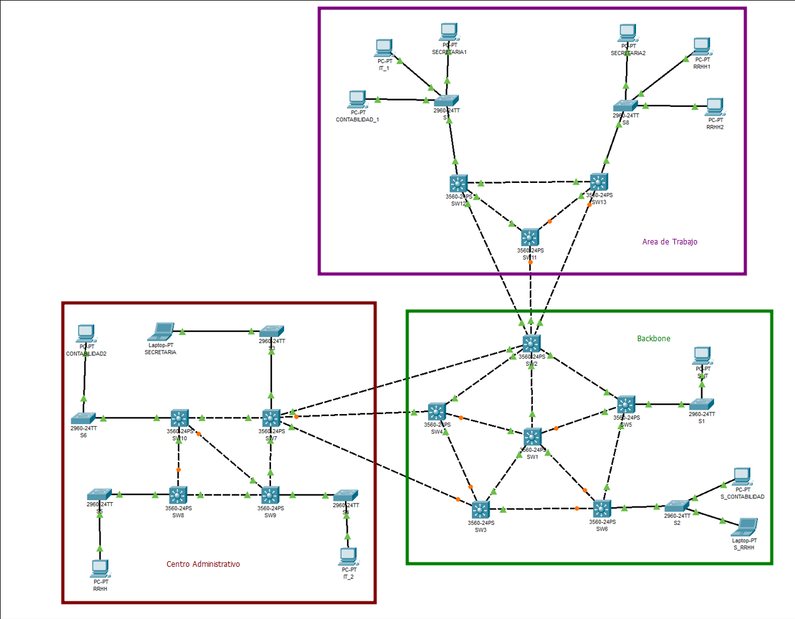
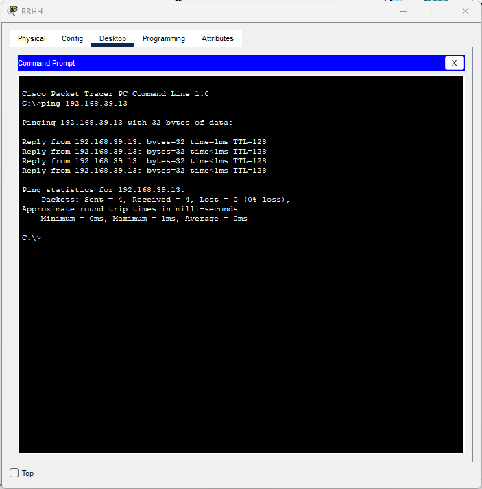
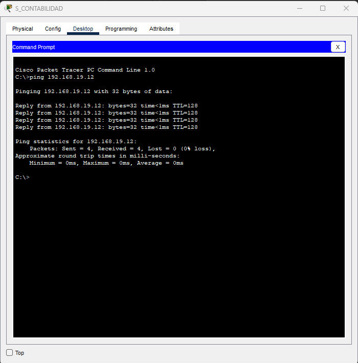

# Proyecto 1

_Este es un proyecto universitario del curso de Redes de Computadoras 1, en donde se demuestra la creación de VLANS y el protocolo VTP_

## 🚀 Comenzando

### 📋 Requerimientos

* Cisco Packet Tracer - 8.2.1.0118

### Indice

* [Documentación](#documentacion)
    * [Topologia](#topologia)
    * [Conexión de SWITCHS](#conexion-switchs)
        * [Centro Administrativo](#centro-administrativo)
        * [Area de Trabajo](#centro-administrativo)
        * [Area de Trabajo ↔️ Backbone](#area-trabajo-backbone)
        * [Centro Administrativo ↔️ Backbone](#centro-administrativo-backbone)
    * [Asignación de IPs](#asignacion-ips)
    * [Configuración Centro Administrativo](#configuracion-centro-administrativo)
        * [S3 (Cliente)](#s3)
        * [S6 (Cliente)](#s6)
        * [S5 (Cliente)](#s5)
        * [S4 (Cliente)](#s4)
        * [SW7 (Cliente)](#sw7)
        * [SW8 (Cliente)](#sw8)
        * [SW10 (Cliente)](#sw10)
        * [S9 (Transparente)](#sw9)
    * [Configuración Backbone](#configuracion-backbone)
        * [S1 (Cliente)](#s1)
        * [S2 (Cliente)](#s2)
        * [SW2 (Cliente)](#sw2)
        * [SW3 (Cliente)](#sw3)
        * [SW4 (Cliente)](#sw4)
        * [SW5 (Cliente)](#sw5)
        * [SW6 (Cliente)](#sw6)
        * [SW7 (Servidor)](#sw7)
    * [Configuración Area de Trabajo](#configuracion-area-trabajo)
        * [S7 (Cliente)](#s7)
        * [S8 (Cliente)](#s8)
        * [SW11 (Cliente)](#sw11)
        * [SW12 (Cliente)](#sw12)
        * [SW13 (Cliente)](#sw13)
    * [Ping Entre Hosts](#ping-hosts)

### 🎁 Otros

* [Enunciado]([Redes1]Proyecto1.pdf)

## 📖 Documentacion <div id='documentacion'></div>

### 🔎 Topologia <div id="topologia"></div>



### 🌐 Conexión de SWITCHS <div id="conexion-switchs"></div>

#### Centro Administrativo <div id="centro-administrativo"></div>

| Origen         | Destino | Puerto Origen | Puerto Destino |
| -------------- | ------- | ------------- | -------------- |
| CONTABILIDAD2  | S6      | f0            | f0/1           |
| RRHH           | S5      | f0            | f0/1           |
| IT_2           | S4      | f0            | f0/1           |
| SECRETARIA           | S3      | f0            | f0/1           |
| SW10           | SW7      | f0/1            | f0/1           |
| SW8           | SW9      | f0/1            | f0/1           |
| S3           | SW7      | f0/2            | f0/2           |
| S6           | SW10      | f0/2            | f0/2           |
| S5           | SW8      | f0/2            | f0/2           |
| S4           | SW9      | f0/2            | f0/2           |
| SW7           | SW9      | f0/3            | f0/3           |
| SW10           | SW8      | f0/3            | f0/3           |
| SW10           | SW9      | f0/4            | f0/4           |

#### Area de Trabajo <div id="area-trabajo"></div>

| Origen         | Destino | Puerto Origen | Puerto Destino |
| -------------- | ------- | ------------- | -------------- |
| S7  | SW12      | f0/1            | f0/1           |
| S8  | SW13      | f0/1            | f0/1           |
| SW12  | SW13      | f0/2            | f0/2           |
| SECRETARIA1  | S7      | f0            | f0/2           |
| IT_1  | S7      | f0            | f0/3           |
| CONTABILIDAD_1  | S7      | f0            | f0/4           |
| SECRETARIA2  | S8      | f0            | f0/2           |
| RRHH1  | S8      | f0            | f0/3           |
| RRHH2  | S8      | f0            | f0/4           |
| SW11  | SW13      | f0/1            | f0/3           |
| SW11  | SW12      | f0/2            | f0/3           |

#### Area de Trabajo ↔️ Backbone <div id="area-trabajo-backbone"></div>

| Origen         | Destino | Puerto Origen | Puerto Destino |
| -------------- | ------- | ------------- | -------------- |
| SW11  | SW2      | f0/3            | f0/4           |
| SW12  | SW2      | f0/4            | f0/6           |
| SW13  | SW2      | f0/4            | f0/5           |

#### Centro Administrativo ↔️ Backbone <div id="centro-administrativo-backbone"></div>

| Origen         | Destino | Puerto Origen | Puerto Destino |
| -------------- | ------- | ------------- | -------------- |
| SW2  | SW7      | f0/7            | f0/4           |
| SW3  | SW7      | f0/4            | f0/6           |
| SW4  | SW7      | f0/4            | f0/5           |

### 🔢 Asignación de IPs <div id="asignacion-ips"></div>

| Dispositivo         | VLAN |  IPv4 |
| -------------- | ------- |  ------- |
| S_CONTABILIDAD  | 19  |  192.168.19.10      |
| CONTABILIDAD_1  | 19 |  192.168.19.11      |
| CONTABILIDAD2  | 19 |  192.168.19.12      |
| SECRETARIA  | 29 |  192.168.29.10      |
| SECRETARIA1  | 29 |  192.168.29.11      |
| SECRETARIA2  | 29 |  192.168.29.12      |
| S_RRHH  | 39 |  192.168.39.10      |
| RRHH  | 39 |  192.168.39.11      |
| RRHH1  | 39 |  192.168.39.12      |
| RRHH2  | 39 |  192.168.39.13      |
| S_IT  | 49 |  192.168.49.10      |
| IT_1  | 49 |  192.168.49.11      |
| IT_2  | 49 |  192.168.49.12      |

### 🔩 Configuración Centro Administrativo <div id="configuracion-centro-administrativo"></div>

#### Para el S3 (Cliente) <div id="s3"></div>

* Configuración inicial

    ```console
    enable
    conf t
    no ip domain-lookup
    hostname S3
    do w
    ```

* Configuración del modo truncal

    ```console
    int f0/2
    switchport mode trunk
    exit
    do w
    ```

* Configuración del protocolo

    ```console
    vtp mode client
    vtp domain P32
    vtp password usac
    do w
    ```

* Configuración del modo de acceso

    ```console
    int f0/1
    switchport mode access
    switchport access vlan 29
    do w
    ```

#### Para el S6 (Cliente) <div id="s6"></div>

* Configuración inicial

    ```console
    enable
    conf t
    no ip domain-lookup
    hostname S6
    do w
    ```

* Configuración del modo truncal

    ```console
    int f0/2
    switchport mode trunk
    exit
    do w
    ```

* Configuración del protocolo

    ```console
    vtp mode client
    vtp domain P32
    vtp password usac
    do w
    ```

* Configuración del modo de acceso

    ```console
    int f0/1
    switchport mode access
    switchport access vlan 19
    do w
    ```

#### Para el S5 (Cliente) <div id="s5"></div>

* Configuración inicial

    ```console
    enable
    conf t
    no ip domain-lookup
    hostname S5
    do w
    ```

* Configuración del modo truncal

    ```console
    int f0/2
    switchport mode trunk
    exit
    do w
    ```

* Configuración del protocolo

    ```console
    vtp mode client
    vtp domain P32
    vtp password usac
    do w
    ```

* Configuración del modo de acceso

    ```console
    int f0/1
    switchport mode access
    switchport access vlan 39
    do w
    ```

#### Para el S4 (Cliente) <div id="s4"></div>

* Configuración inicial

    ```console
    enable
    conf t
    no ip domain-lookup
    hostname S4
    do w
    ```

* Configuración del modo truncal

    ```console
    int f0/2
    switchport mode trunk
    exit
    do w
    ```

* Configuración del protocolo

    ```console
    vtp mode client
    vtp domain P32
    vtp password usac
    do w
    ```

* Configuración del modo de acceso

    ```console
    int f0/1
    switchport mode access
    switchport access vlan 49
    do w
    ```

#### Para el SW7 (Cliente) <div id="sw7"></div>

* Configuración inicial

    ```console
    enable
    conf t
    no ip domain-lookup
    hostname SW7
    do w
    ```

* Configuración del modo truncal

    ```console
    interface range fa0/1-6
    switchport trunk encapsulation dot1q
    switchport mode trunk
    exit
    do w
    ```

* Configuración del protocolo

    ```console
    vtp mode client
    vtp domain P32
    vtp password usac
    do w
    ```

#### Para el SW8 (Cliente) <div id="sw8"></div>

* Configuración inicial

    ```console
    enable
    conf t
    no ip domain-lookup
    hostname SW8
    do w
    ```

* Configuración del modo truncal

    ```console
    interface range fa0/1-3
    switchport trunk encapsulation dot1q
    switchport mode trunk
    exit
    do w
    ```

* Configuración del protocolo

    ```console
    vtp mode client
    vtp domain P32
    vtp password usac
    do w
    ```

#### Para el SW10 (Cliente) <div id="sw10"></div>

* Configuración inicial

    ```console
    enable
    conf t
    no ip domain-lookup
    hostname SW10
    do w
    ```

* Configuración del modo truncal

    ```console
    interface range fa0/1-4
    switchport trunk encapsulation dot1q
    switchport mode trunk
    exit
    do w
    ```

* Configuración del protocolo

    ```console
    vtp mode client
    vtp domain P32
    vtp password usac
    do w
    ```

#### Para el SW9 (Transparente) <div id="sw9"></div>

* Configuración inicial

    ```console
    enable
    conf t
    no ip domain-lookup
    hostname SW9
    do w
    ```

* Configuración del modo

    ```console
    vtp mode transparent
    vtp domain P32
    vtp password usac
    do w
    ```

### 🔩 Configuración Backbone <div id="configuracion-backbone"></div>

#### Para el S1 (Cliente) <div id="s1"></div>

* Configuración inicial

    ```console
    enable
    conf t
    no ip domain-lookup
    hostname S1
    do w
    ```

* Configuración del modo truncal

    ```console
    int f0/1
    switchport mode trunk
    exit
    do w
    ```

* Configuración del protocolo

    ```console
    vtp mode client
    vtp domain P32
    vtp password usac
    do w
    ```

* Configuración del modo de acceso

    ```console
    int f0/2
    switchport mode access
    switchport access vlan 49
    do w
    ```

#### Para el S2 (Cliente) <div id="s2"></div>

* Configuración inicial

    ```console
    enable
    conf t
    no ip domain-lookup
    hostname S2
    do w
    ```

* Configuración del modo truncal

    ```console
    int f0/1
    switchport mode trunk
    exit
    do w
    ```

* Configuración del protocolo

    ```console
    vtp mode client
    vtp domain P32
    vtp password usac
    do w
    ```

* Configuración del modo de acceso

    ```console
    int f0/3
    switchport mode access
    switchport access vlan 19
    do w
    ```

    ```console
    int f0/2
    switchport mode access
    switchport access vlan 39
    do w
    ```

#### Para el SW2 (Cliente) <div id="sw2"></div>

* Configuración inicial

    ```console
    enable
    conf t
    no ip domain-lookup
    hostname SW2
    do w
    ```

* Configuración del modo truncal

    ```console
    interface range fa0/1-7
    switchport trunk encapsulation dot1q
    switchport mode trunk
    exit
    do w
    ```

* Configuración del protocolo

    ```console
    vtp mode client
    vtp domain P32
    vtp password usac
    do w
    ```

#### Para el SW3 (Cliente) <div id="sw3"></div>

* Configuración inicial

    ```console
    enable
    conf t
    no ip domain-lookup
    hostname SW3
    do w
    ```

* Configuración del modo truncal

    ```console
    interface range fa0/1-4
    switchport trunk encapsulation dot1q
    switchport mode trunk
    exit
    do w
    ```

* Configuración del protocolo

    ```console
    vtp mode client
    vtp domain P32
    vtp password usac
    do w
    ```

#### Para el SW4 (Cliente) <div id="sw4"></div>

* Configuración inicial

    ```console
    enable
    conf t
    no ip domain-lookup
    hostname SW4
    do w
    ```

* Configuración del modo truncal

    ```console
    interface range fa0/1-4
    switchport trunk encapsulation dot1q
    switchport mode trunk
    exit
    do w
    ```

* Configuración del protocolo

    ```console
    vtp mode client
    vtp domain P32
    vtp password usac
    do w
    ```

#### Para el SW5 (Cliente) <div id="sw5"></div>

* Configuración inicial

    ```console
    enable
    conf t
    no ip domain-lookup
    hostname SW5
    do w
    ```

* Configuración del modo truncal

    ```console
    interface range fa0/1-4
    switchport trunk encapsulation dot1q
    switchport mode trunk
    exit
    do w
    ```

* Configuración del protocolo

    ```console
    vtp mode client
    vtp domain P32
    vtp password usac
    do w
    ```

#### Para el SW6 (Cliente) <div id="sw6"></div>

* Configuración inicial

    ```console
    enable
    conf t
    no ip domain-lookup
    hostname SW6
    do w
    ```

* Configuración del modo truncal

    ```console
    interface range fa0/1-4
    switchport trunk encapsulation dot1q
    switchport mode trunk
    exit
    do w
    ```

* Configuración del protocolo

    ```console
    vtp mode client
    vtp domain P32
    vtp password usac
    do w
    ```

#### Para el SW7 (Servidor) <div id="sw7"></div>

* Configuración inicial

    ```console
    enable
    conf t
    no ip domain-lookup
    hostname SW7
    do w
    ```

* Configuración del modo truncal

    ```console
    interface range fa0/1-5
    switchport trunk encapsulation dot1q
    switchport mode trunk
    exit
    do w
    ```

* Creación de VLANs

    ```console
    vlan 19
    name CONTABILIDAD
    vlan 29
    name SECRETARIA
    vlan 39
    name RRHH
    vlan 49
    name IT
    exit
    do w
    ```

* Configuración del protocolo

    ```console
    vtp version 2
    vtp mode server
    vtp domain P32
    vtp password usac
    do w
    ```

* Configuracion del STP

    ```console
    spanning-tree vlan 1 root primary
    spanning-tree vlan 19 root primary
    spanning-tree vlan 29 root primary
    spanning-tree vlan 39 root primary
    spanning-tree vlan 49 root primary
    ```

### 🔩 Configuración Area de Trabajo <div id="configuracion-area-trabajo"></div>

#### Para el S7 (Cliente) <div id="s7"></div>

* Configuración inicial

    ```console
    enable
    conf t
    no ip domain-lookup
    hostname S7
    do w
    ```

* Configuración del modo truncal

    ```console
    int f0/1
    switchport mode trunk
    exit
    do w
    ```

* Configuración del protocolo

    ```console
    vtp mode client
    vtp domain P32
    vtp password usac
    do w
    ```

* Configuración del modo de acceso

    ```console
    int f0/2
    switchport mode access
    switchport access vlan 29
    do w

    int f0/3
    switchport mode access
    switchport access vlan 49
    do w

    int f0/4
    switchport mode access
    switchport access vlan 19
    do w
    ```

#### Para el S8 (Cliente) <div id="s8"></div>

* Configuración inicial

    ```console
    enable
    conf t
    no ip domain-lookup
    hostname S8
    do w
    ```

* Configuración del modo truncal

    ```console
    int f0/1
    switchport mode trunk
    exit
    do w
    ```

* Configuración del protocolo

    ```console
    vtp mode client
    vtp domain P32
    vtp password usac
    do w
    ```

* Configuración del modo de acceso

    ```console
    int f0/2
    switchport mode access
    switchport access vlan 29
    do w

    int f0/3
    switchport mode access
    switchport access vlan 39 
    do w

    int f0/4
    switchport mode access
    switchport access vlan 39 
    do w
    ```

#### Para el SW11 (Cliente) <div id="sw11"></div>

* Configuración inicial

    ```console
    enable
    conf t
    no ip domain-lookup
    hostname SW11
    do w
    ```

* Configuración del modo truncal

    ```console
    interface range fa0/1-3
    switchport trunk encapsulation dot1q
    switchport mode trunk
    exit
    do w
    ```

* Configuración del protocolo

    ```console
    vtp mode client
    vtp domain P32
    vtp password usac
    do w
    ```


#### Para el SW12 (Cliente) <div id="sw12"></div>

* Configuración inicial

    ```console
    enable
    conf t
    no ip domain-lookup
    hostname SW12
    do w
    ```

* Configuración del modo truncal

    ```console
    interface range fa0/1-4
    switchport trunk encapsulation dot1q
    switchport mode trunk
    exit
    do w
    ```

* Configuración del protocolo

    ```console
    vtp mode client
    vtp domain P32
    vtp password usac
    do w
    ```

#### Para el SW13 (Cliente) <div id="sw13"></div>

* Configuración inicial

    ```console
    enable
    conf t
    no ip domain-lookup
    hostname SW13
    do w
    ```

* Configuración del modo truncal

    ```console
    interface range fa0/1-4
    switchport trunk encapsulation dot1q
    switchport mode trunk
    exit
    do w
    ```

* Configuración del protocolo

    ```console
    vtp mode client
    vtp domain P32
    vtp password usac
    do w
    ```

**Extras**

* Pasar de PVST a RSTP (Esto debe de realizarse en todos los switches)

    ```console
    enable
    config t
    spanning-tree mode rapid-pvst
    ```

* En el caso que una ip se comunique con otra estando en diferentes vlans, se utiliza el siguiente comando:

    ```console
    access-list [ID_CUALQUIERA] deny ip [IP_DISPOSITIVO_1] 0.0.0.255 [IP_DISPOSITIVO_2] 0.0.0.255
    ```


### 🔩 Ping Entre Hosts

#### Ping del Host 192.168.39.11 (RRHH) al Host 192.168.39.13 (RRHH2)



#### Ping del Host 192.168.19.10 (S_CONTABILIDAD) al Host 192.168.19.12 (CONTABILIDAD2)

