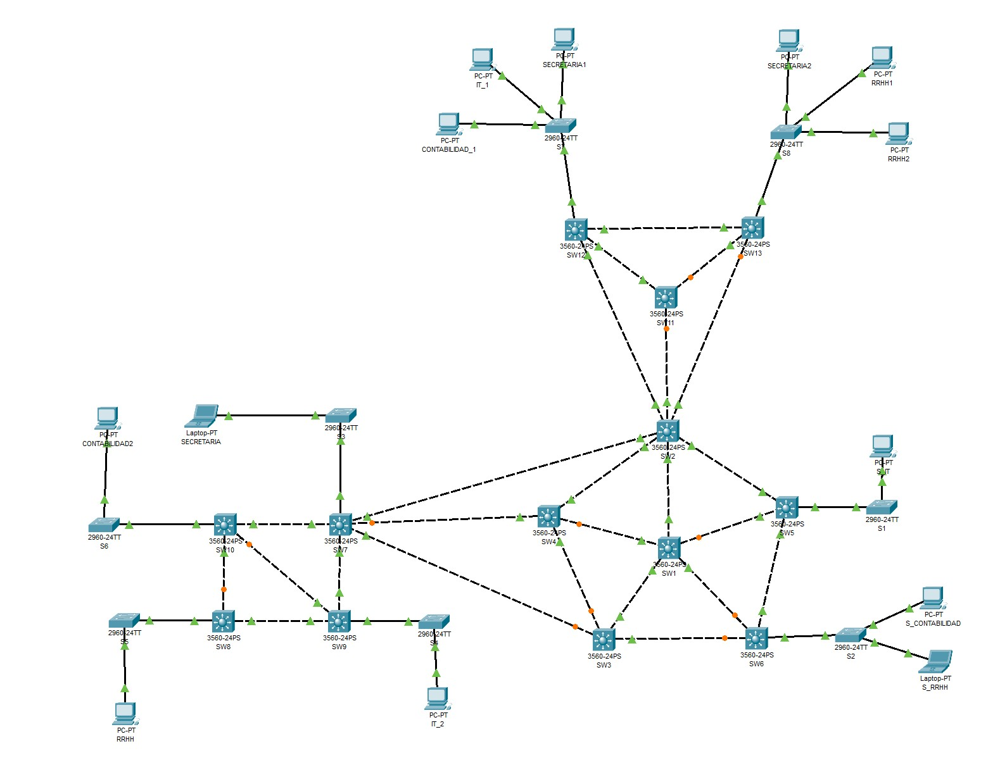

# Proyecto 1

_Este es un proyecto universitario del curso de Redes de Computadoras 1, en donde se demuestra la creación de VLANS y el protocolo VTP_

## 🚀 Comenzando

### 📋 Requerimientos

* Cisco Packet Tracer - 8.2.1.0118

### Indice


### 🎁 Otros

* [Enunciado]([Redes1]Proyecto1.pdf)
* Comandos

## 📖 Documentacion

### 🔎 Topologia



### 🌐 Conexión de SWITCHS

#### Centro Administrativo

| Origen         | Destino | Puerto Origen | Puerto Destino |
| -------------- | ------- | ------------- | -------------- |
| CONTABILIDAD2  | S6      | f0            | f0/1           |
| RRHH           | S5      | f0            | f0/1           |
| IT_2           | S4      | f0            | f0/1           |
| SECRETARIA           | S3      | f0            | f0/1           |
| SW10           | SW7      | f0/1            | f0/1           |
| SW8           | SW9      | f0/1            | f0/1           |
| S3           | SW7      | f0/2            | f0/2           |
| S6           | SW10      | f0/2            | f0/2           |
| S5           | SW8      | f0/2            | f0/2           |
| S4           | SW9      | f0/2            | f0/2           |
| SW7           | SW9      | f0/3            | f0/3           |
| SW10           | SW8      | f0/3            | f0/3           |
| SW10           | SW9      | f0/4            | f0/4           |

#### Area de Trabajo

| Origen         | Destino | Puerto Origen | Puerto Destino |
| -------------- | ------- | ------------- | -------------- |
| S7  | SW12      | f0/1            | f0/1           |
| S8  | SW13      | f0/1            | f0/1           |
| SW12  | SW13      | f0/2            | f0/2           |
| SECRETARIA1  | S7      | f0            | f0/2           |
| IT_1  | S7      | f0            | f0/3           |
| CONTABILIDAD_1  | S7      | f0            | f0/4           |
| SECRETARIA2  | S8      | f0            | f0/2           |
| RRHH1  | S8      | f0            | f0/3           |
| RRHH2  | S8      | f0            | f0/4           |
| SW11  | SW13      | f0/1            | f0/3           |
| SW11  | SW12      | f0/2            | f0/3           |

#### Area de Trabajo ↔️ Backbone

| Origen         | Destino | Puerto Origen | Puerto Destino |
| -------------- | ------- | ------------- | -------------- |
| SW11  | SW2      | f0/3            | f0/4           |
| SW12  | SW2      | f0/4            | f0/6           |
| SW13  | SW2      | f0/4            | f0/5           |

#### Centro Administrativo ↔️ Backbone

| Origen         | Destino | Puerto Origen | Puerto Destino |
| -------------- | ------- | ------------- | -------------- |
| SW2  | SW7      | f0/7            | f0/4           |
| SW3  | SW7      | f0/4            | f0/6           |
| SW4  | SW7      | f0/4            | f0/5           |

### 🔢 Asignación de IPs

| Dispositivo         | VLAN |  IPv4 |
| -------------- | ------- |  ------- |
| S_CONTABILIDAD  | 111  |  192.168.111.10      |
| CONTABILIDAD_1  | 111 |  192.168.111.11      |
| CONTABILIDAD2  | 111 |  192.168.111.12      |
| SECRETARIA  | 211 |  192.168.211.10      |
| SECRETARIA1  | 211 |  192.168.211.11      |
| SECRETARIA2  | 211 |  192.168.211.12      |
| S_RRHH  | 311 |  192.168.311.10      |
| RRHH  | 311 |  192.168.311.11      |
| RRHH1  | 311 |  192.168.311.12      |
| RRHH2  | 311 |  192.168.311.13      |
| S_IT  | 411 |  192.168.411.10      |
| IT_1  | 411 |  192.168.411.11      |
| IT_2  | 411 |  192.168.411.12      |

### 🔩 Configuración Centro Administrativo

#### Para el S3 (Cliente)

* Configuración inicial

    ```console
    enable
    conf t
    no ip domain-lookup
    hostname S3
    do w
    ```

* Configuración del modo truncal

    ```console
    int f0/2
    switchport mode trunk
    exit
    do w
    ```

* Configuración del protocolo

    ```console
    vtp mode client
    vtp domain P32
    vtp password usac
    do w
    ```

* Configuración del modo de acceso

    ```console
    int f0/1
    switchport mode access
    switchport access vlan 211
    do w
    ```

#### Para el S6 (Cliente)

* Configuración inicial

    ```console
    enable
    conf t
    no ip domain-lookup
    hostname S6
    do w
    ```

* Configuración del modo truncal

    ```console
    int f0/2
    switchport mode trunk
    exit
    do w
    ```

* Configuración del protocolo

    ```console
    vtp mode client
    vtp domain P32
    vtp password usac
    do w
    ```

* Configuración del modo de acceso

    ```console
    int f0/1
    switchport mode access
    switchport access vlan 111
    do w
    ```

#### Para el S5 (Cliente)

* Configuración inicial

    ```console
    enable
    conf t
    no ip domain-lookup
    hostname S5
    do w
    ```

* Configuración del modo truncal

    ```console
    int f0/2
    switchport mode trunk
    exit
    do w
    ```

* Configuración del protocolo

    ```console
    vtp mode client
    vtp domain P32
    vtp password usac
    do w
    ```

* Configuración del modo de acceso

    ```console
    int f0/1
    switchport mode access
    switchport access vlan 311
    do w
    ```

#### Para el S4 (Cliente)

* Configuración inicial

    ```console
    enable
    conf t
    no ip domain-lookup
    hostname S4
    do w
    ```

* Configuración del modo truncal

    ```console
    int f0/2
    switchport mode trunk
    exit
    do w
    ```

* Configuración del protocolo

    ```console
    vtp mode client
    vtp domain P32
    vtp password usac
    do w
    ```

* Configuración del modo de acceso

    ```console
    int f0/1
    switchport mode access
    switchport access vlan 411
    do w
    ```

#### Para el SW7 (Cliente)

* Configuración inicial

    ```console
    enable
    conf t
    no ip domain-lookup
    hostname SW7
    do w
    ```

* Configuración del modo truncal

    ```console
    interface range fa0/1-6
    switchport trunk encapsulation dot1q
    switchport mode trunk
    exit
    do w
    ```

* Configuración del protocolo

    ```console
    vtp mode client
    vtp domain P32
    vtp password usac
    do w
    ```

#### Para el SW8 (Cliente)

* Configuración inicial

    ```console
    enable
    conf t
    no ip domain-lookup
    hostname SW8
    do w
    ```

* Configuración del modo truncal

    ```console
    interface range fa0/1-3
    switchport trunk encapsulation dot1q
    switchport mode trunk
    exit
    do w
    ```

* Configuración del protocolo

    ```console
    vtp mode client
    vtp domain P32
    vtp password usac
    do w
    ```

#### Para el SW10 (Cliente)

* Configuración inicial

    ```console
    enable
    conf t
    no ip domain-lookup
    hostname SW10
    do w
    ```

* Configuración del modo truncal

    ```console
    interface range fa0/1-4
    switchport trunk encapsulation dot1q
    switchport mode trunk
    exit
    do w
    ```

* Configuración del protocolo

    ```console
    vtp mode client
    vtp domain P32
    vtp password usac
    do w
    ```

#### Para el SW9 (Transparente)

* Configuración inicial

    ```console
    enable
    conf t
    no ip domain-lookup
    hostname SW9
    do w
    ```

* Configuración del modo

    ```console
    vtp mode transparent
    vtp domain P32
    vtp password usac
    do w
    ```

### 🔩 Configuración Backbone

#### Para el S1 (Cliente)

* Configuración inicial

    ```console
    enable
    conf t
    no ip domain-lookup
    hostname S1
    do w
    ```

* Configuración del modo truncal

    ```console
    int f0/1
    switchport mode trunk
    exit
    do w
    ```

* Configuración del protocolo

    ```console
    vtp mode client
    vtp domain P32
    vtp password usac
    do w
    ```

* Configuración del modo de acceso

    ```console
    int f0/2
    switchport mode access
    switchport access vlan 411
    do w
    ```

#### Para el S2 (Cliente)

* Configuración inicial

    ```console
    enable
    conf t
    no ip domain-lookup
    hostname S2
    do w
    ```

* Configuración del modo truncal

    ```console
    int f0/1
    switchport mode trunk
    exit
    do w
    ```

* Configuración del protocolo

    ```console
    vtp mode client
    vtp domain P32
    vtp password usac
    do w
    ```

* Configuración del modo de acceso

    ```console
    int f0/3
    switchport mode access
    switchport access vlan 111
    do w
    ```

    ```console
    int f0/2
    switchport mode access
    switchport access vlan 311
    do w
    ```

#### Para el SW2 (Cliente)

* Configuración inicial

    ```console
    enable
    conf t
    no ip domain-lookup
    hostname SW2
    do w
    ```

* Configuración del modo truncal

    ```console
    interface range fa0/1-7
    switchport trunk encapsulation dot1q
    switchport mode trunk
    exit
    do w
    ```

* Configuración del protocolo

    ```console
    vtp mode client
    vtp domain P32
    vtp password usac
    do w
    ```

#### Para el SW3 (Cliente)

* Configuración inicial

    ```console
    enable
    conf t
    no ip domain-lookup
    hostname SW3
    do w
    ```

* Configuración del modo truncal

    ```console
    interface range fa0/1-4
    switchport trunk encapsulation dot1q
    switchport mode trunk
    exit
    do w
    ```

* Configuración del protocolo

    ```console
    vtp mode client
    vtp domain P32
    vtp password usac
    do w
    ```

#### Para el SW4 (Cliente)

* Configuración inicial

    ```console
    enable
    conf t
    no ip domain-lookup
    hostname SW4
    do w
    ```

* Configuración del modo truncal

    ```console
    interface range fa0/1-4
    switchport trunk encapsulation dot1q
    switchport mode trunk
    exit
    do w
    ```

* Configuración del protocolo

    ```console
    vtp mode client
    vtp domain P32
    vtp password usac
    do w
    ```

#### Para el SW5 (Cliente)

* Configuración inicial

    ```console
    enable
    conf t
    no ip domain-lookup
    hostname SW5
    do w
    ```

* Configuración del modo truncal

    ```console
    interface range fa0/1-4
    switchport trunk encapsulation dot1q
    switchport mode trunk
    exit
    do w
    ```

* Configuración del protocolo

    ```console
    vtp mode client
    vtp domain P32
    vtp password usac
    do w
    ```

#### Para el SW6 (Cliente)

* Configuración inicial

    ```console
    enable
    conf t
    no ip domain-lookup
    hostname SW6
    do w
    ```

* Configuración del modo truncal

    ```console
    interface range fa0/1-4
    switchport trunk encapsulation dot1q
    switchport mode trunk
    exit
    do w
    ```

* Configuración del protocolo

    ```console
    vtp mode client
    vtp domain P32
    vtp password usac
    do w
    ```

#### Para el SW7 (Servidor)

* Configuración inicial

    ```console
    enable
    conf t
    no ip domain-lookup
    hostname SW7
    do w
    ```

* Configuración del modo truncal

    ```console
    interface range fa0/1-5
    switchport trunk encapsulation dot1q
    switchport mode trunk
    # switchport trunk allowed vlan 111, 211, 311, 411, 1002-1005
    exit
    do w
    ```

* Creación de VLANs

    ```console
    vlan 111
    name CONTABILIDAD
    vlan 211
    name SECRETARIA
    vlan 311
    name RRHH
    vlan 411
    name IT
    exit
    do w
    ```

* Configuración del protocolo

    ```console
    vtp version 2
    vtp mode server
    vtp domain P32
    vtp password usac
    do w
    ```

* Configuracion del STP

    ```console
    spanning-tree vlan 1 root primary
    spanning-tree vlan 111 root primary
    spanning-tree vlan 211 root primary
    spanning-tree vlan 311 root primary
    spanning-tree vlan 411 root primary
    ```

**Extras**

* Pasar de PVST a RSTP (Esto debe de realizarse en todos los switches)

    ```console
    enable
    config t
    spanning-tree mode rapid-pvst
    ```

* En el caso que una ip se comunique con otra estando en diferentes vlans, se utiliza el siguiente comando:

    ```console
    access-list [ID_CUALQUIERA] deny IP [IP_DISPOSITIVO_1] 0.0.0.255 [IP_DISPOSITIVO_2] 0.0.0.255
    ```
