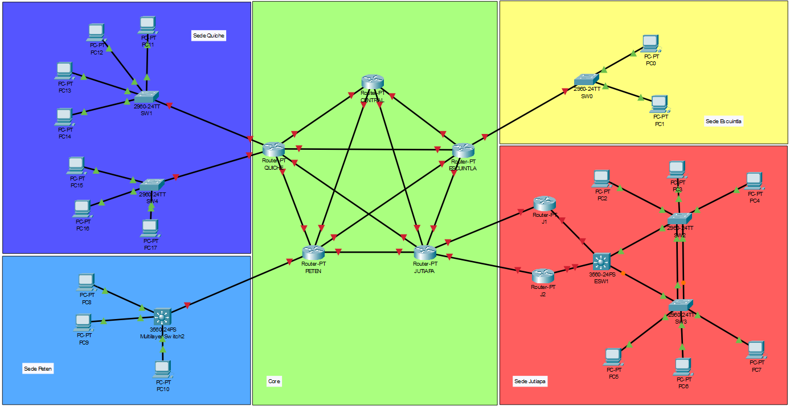

# Proyecto 2

_Este es un proyecto universitario del curso de Redes de Computadoras 1, en donde se demuestra los temas aprendidos en las actividades anteriores._

## 🚀 Comenzando

### 📋 Requerimientos

* Cisco Packet Tracer - 8.2.1.0118

### Indice

* [Documentación](#documentacion)
    * [Topologia](#topologia)

## 🎁 Otros

[Enunciado]([REDES1]Proyecto2.pdf)

## 📖 Documentacion <div id='documentacion'></div>

### 🔎 Topologia <div id="topologia"></div>



### 🔢 Calculo del VLSM <div id="calculo-vlsm"></div>

Para ilustrar el proceso de cálculo del VLSM, se utilizará como ejemplo la sede de **Jutiapa** durante toda la explicación.

#### Paso 1: Ordenamiento

Las VLANs se organizan de acuerdo con la cantidad de equipos necesarios para cada una, ordenándolas de mayor a menor.

|VLAN|ID VLAN|Equipos|
|:----|:----|:----|
|Ventas|32|25|
|Informatica|42|12|
|RRHH|12|10|
|Contabilidad|22|4|

#### Paso 2: Asignacion de mascara y wildcard

Es importante tener en cuenta que al definir la mascara de una red es necesario determinar la cantidad de hosts que deseamos tener en la red, para esto debemos considerar dos aspectos clave:

* La Parte de Red.
* La Parte de Host.

Es a través de la *Parte de Host* que se establece la cantidad de direcciones IP disponibles en la red. Por lo tanto, resulta crucial realizar los cálculos correspondientes para determinar adecuadamente la cantidad de hosts que la red podrá alojar.

A modo de ejemplo, se utilizará la VLAN 'Ventas'.

1. **Calcular la cantidad de equipos para la _Parte de Host_**

    Para determinar la cantidad de equipos, empleamos la fórmula $2^n$. A continuación, evaluamos varias opciones:

    * Cuando $n=4$, resulta en $2^4 = 16$ equipos.
    * Cuando $n=5$, resulta en $2^5 = 32$ equipos.
    * Cuando $n=6$, resulta en $2^6 = 64$ equipos.
    
    Después de obtener los resultados, determinamos que la opción que mejor se ajusta a la cantidad de equipos requeridos es cuando $n=5$.

    **N** representa la cantidad de bits que se utilizan para identificar la _Parte de Host_.

2. **Determinación de la cantidad de bits para la _Parte de Red_**

    Una vez calculado **N**, procedemos a determinar la cantidad de bits utilizados para la _Parte de Red_. Este cálculo se realiza de la siguiente manera:
    
    $32 - 5 = 27$ bits

    Por lo tanto, se concluye que la cantidad de bits para la _Parte de Red_ es de 27 bits, lo que se expresa en notación CIDR como /27.

    > Nota: Se resta con 32 debido a que estamos evaluando una dirección IPv4, la cual consta de 32 bits.

3. **Calculo de la mascara en decimal**

    Dado que la dirección IP consta de 32 bits, estos se representan de la siguiente manera:

    _Parte de Red_ + _Parte de Host_

    En este caso, la _Parte de Red_, que consta de 27 bits, se representa con unos (1s), mientras que la _Parte de Host_, con 5 bits, se representa con ceros (0s). En binario y decimal, esto se ve así:

    $11111111.11111111.11111111.11100000 = 255.255.255.224$

    Entonces la mascara es **255.255.255.224**

4. **Calculo del Wildcard**

    Para realizar este cálculo, se debe utilizar exclusivamente la cantidad de equipos determinada en el **paso 1**. En este ejemplo, con 32 equipos numerados del 0 al 31, el wildcard correspondiente es 0.0.0.31.

El calculo anteriormente visto, fue aplicado en cada VLAN, por lo cual, se obtuvo la siguiente tabla.

|VLAN|ID VLAN|Equipos|Mascara|Wildcard|
|:----|:----|:----|:----|:----|
|Ventas|32|25|255.255.255.224|0.0.0.31|
|Informatica|42|12|255.255.255.240|0.0.0.15|
|RRHH|12|10|255.255.255.240|0.0.0.15|
|Contabilidad|22|4|255.255.255.248|0.0.0.7|

#### Paso 3: Asignación de ID Red, Primera IP, Ultima IP e IP Broadcast

Donde:

* XX = 29
* Red Interna (Sede Jutiapa) = 192.168.XX.0/24 = 192.168.29.0/24

1. **Asignación de ID Red**

    Se asigna la red interna inicial.

    En este caso se define: 192.168.29.0

2. **Asignación de Primera IP**

    Sería la IP siguiente en la secuencia.

    En este caso se define: 192.168.29.1

3. **Asignación de Ultima IP**

    Sería la IP del broadcast menos 1

    En este caso se define: 192.168.29.30

4. **Asignación del Broadcast**

    La dirección de broadcast es la última dirección IP asignable. Esta se determina por la cantidad de Host que hay disponibles
    
    > Nota: Una forma de visualizar la cantidad de Host que hay, es por medio del wildcard

    En este caso se define: 192.168.29.31

> Nota: Para la próxima VLAN, al asignar la ID de Red, es importante definirla en relación con la secuencia que se sigue en la asignación del broadcast.

La tabla obtenida con respecto a las asignaciones son las siguientes:

|VLAN|ID VLAN|Equipos|Mascara|Wildcard|ID Red|Primera IP|Ultima IP|IP Broadcast|
|:----|:----|:----|:----|:----|:----|:----|:----|:----|
|Ventas|32|25|255.255.255.224|0.0.0.31|192.168.29.0|192.168.29.1|192.168.29.30|192.168.29.31|
|Informatica|42|12|255.255.255.240|0.0.0.15|192.168.29.32|192.168.0.33|192.168.29.46|192.168.29.47|
|RRHH|12|10|255.255.255.240|0.0.0.15|192.168.29.48|192.168.29.49|192.168.29.62|192.168.29.63|
|Contabilidad|22|4|255.255.255.248|0.0.0.7|192.168.29.64|192.168.29.65|192.168.29.70|192.168.29.71|

### 📄 VLSM Obtenidos <div id="vlsm-obtenidos"></div>

#### Para la sede de Jutiapa

* ID Red = 192.168.XX.0/24
* XX = 29

|VLAN|ID VLAN|Equipos|Mascara|Wildcard|ID Red|Primera IP|Ultima IP|IP Broadcast|
|:----|:----|:----|:----|:----|:----|:----|:----|:----|
|Ventas|32|25|255.255.255.224|0.0.0.31|192.168.29.0|192.168.29.1|192.168.29.30|192.168.29.31|
|Informatica|42|12|255.255.255.240|0.0.0.15|192.168.29.32|192.168.0.33|192.168.29.46|192.168.29.47|
|RRHH|12|10|255.255.255.240|0.0.0.15|192.168.29.48|192.168.29.49|192.168.29.62|192.168.29.63|
|Contabilidad|22|4|255.255.255.248|0.0.0.7|192.168.29.64|192.168.29.65|192.168.29.70|192.168.29.71|

#### Para la sede de Escuintla

* ID Red = 192.148.XX.0/24
* XX = 29

|VLAN|ID VLAN|Equipos|Mascara|Wildcard|ID Red|Primera IP|Ultima IP|IP Broadcast|
|:----|:----|:----|:----|:----|:----|:----|:----|:----|
|Ventas|3Y|20|255.255.255.224|0.0.0.31|192.148.29.0|192.148.29.1|192.148.29.30|192.148.29.31|
|RRHH|1Y|5|255.255.255.248|0.0.0.7|192.148.29.32|192.148.29.33|192.148.29.38|192.148.29.39|


#### Para la sede de Quiche

* ID Red = 192.178.XX.0/24
* XX = 29

| VLAN         | ID VLAN | Equipos | Mascara         | Wildcard | ID Red         | Primera IP     | Ultima IP      | IP Broadcast   |
|--------------|---------|---------|-----------------|----------|----------------|----------------|----------------|----------------|
| Ventas       | 3Y      | 36      | 255.255.255.192 | 0.0.0.63 | 192.178.29.0   | 192.178.29.1   | 192.178.29.62  | 192.178.29.63  |
| Informatica  | 4Y      | 21      | 255.255.255.224 | 0.0.0.31 | 192.178.29.64  | 192.178.29.65  | 192.178.29.94  | 192.178.29.95  |
| RRHH         | 1Y      | 12      | 255.255.255.240 | 0.0.0.15 | 192.178.29.96  | 192.178.29.97  | 192.178.29.110 | 192.178.29.111 |
| Contabilidad | 2Y      | 10      | 255.255.255.240 | 0.0.0.15 | 192.178.29.112 | 192.178.29.113 | 192.178.29.126 | 192.178.29.127 |

#### Para la sede de Peten

* ID Red = 192.158.XX.0/24
* XX = 29

| VLAN        | ID VLAN | Equipos | Mascara         | Wildcard | ID Red        | Primera IP    | Ultima IP     | IP Broadcast  |
|-------------|---------|---------|-----------------|----------|---------------|---------------|---------------|---------------|
| Ventas      | 3Y      | 30      | 255.255.255.224 | 0.0.0.31 | 192.158.29.0  | 192.158.29.1  | 192.158.29.30 | 192.158.29.31 |
| Informatica | 4Y      | 15      | 255.255.255.224 | 0.0.0.31 | 192.158.29.32 | 192.158.29.33 | 192.158.29.62 | 192.158.29.63 |
| RRHH        | 1Y      | 10      | 255.255.255.240 | 0.0.0.15 | 192.158.29.64 | 192.158.29.65 | 192.158.29.78 | 192.158.29.79 |

<!-- ### 🔩 Configuración de la Sede Jutiapa<div id="configuracion-jutiapa"></div>

#### Para el SW3 (Cliente) <div id="sw3"></div>


* Configuración inicial

    ```console
    enable
    conf t
    no ip domain-lookup
    hostname SW3
    do w
    ```

* Configuración del modo truncal

    ```console
    int f0/2
    switchport mode trunk
    exit
    do w
    ```

* Configuración del protocolo

    ```console
    vtp mode client
    vtp domain P32
    vtp password usac
    do w
    ```

* Configuración del modo de acceso

    ```console
    int range f0/1-3
    switchport mode access
    switchport access vlan 29
    do w
    ``` -->